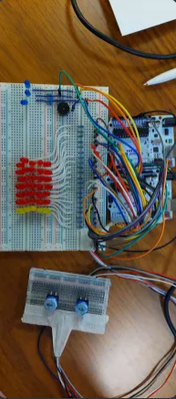

# DON'T DIE FROM STONES A GAME

A game where you should avoid stones falling from the. 

Implementing this project using arduino for the visual representation.

This project uses [Charlieplexing](https://en.wikipedia.org/wiki/Charlieplexing) model for 6 field rows and one player row and
two buttons to control player movement

## Overview Image

To run the code you first need to download Arduino IDE and have two arduinos Connected as Dom and Sub with a UART connection.
